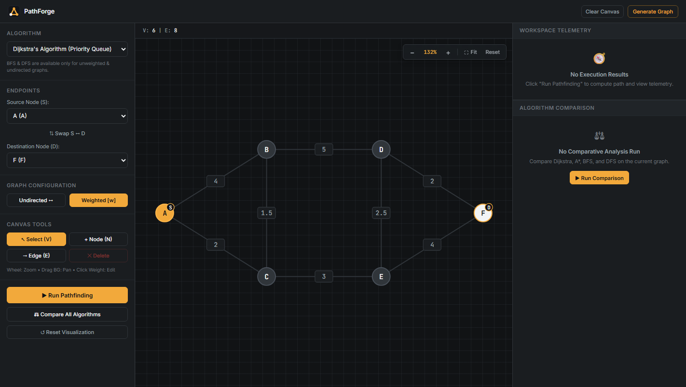
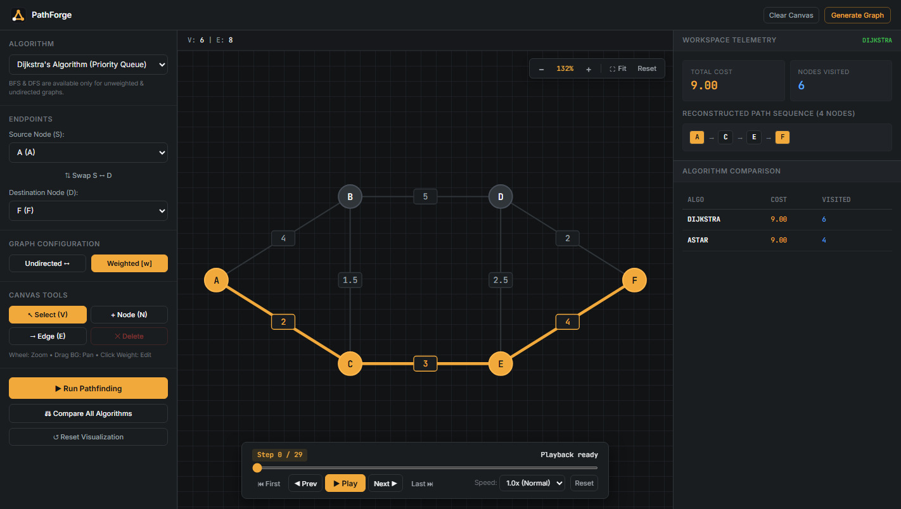
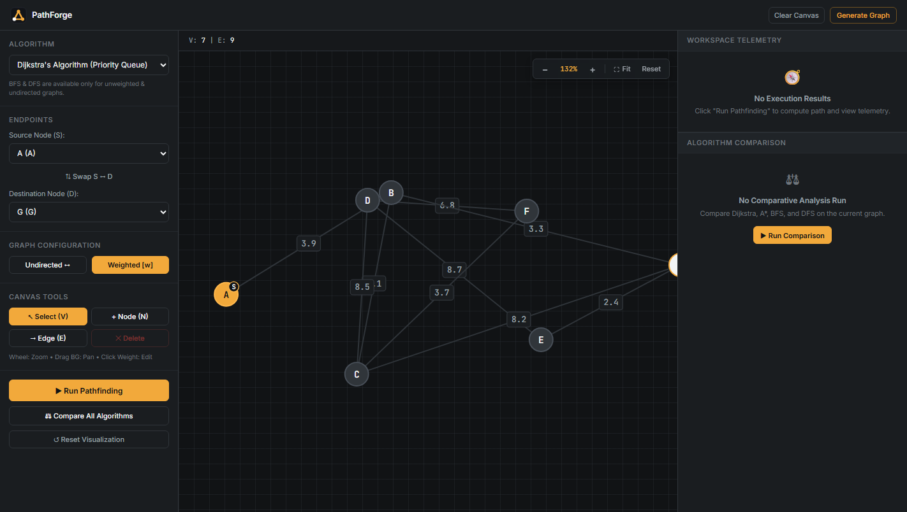
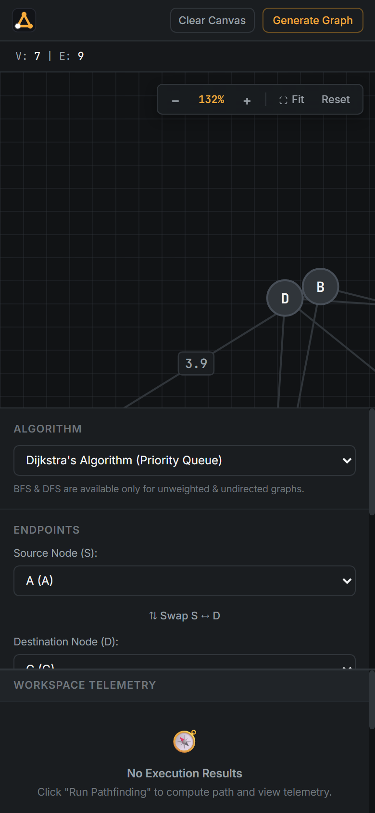

# PathForge — Interactive Graph Pathfinding & Optimization Engine

[](https://opensource.org/licenses/MIT)
[](https://isocpp.org/)
[](https://www.typescriptlang.org/)
[](https://react.dev/)
[](https://nodejs.org/)
[-orange.svg)](https://github.com/Niranjan05Kumar/PathForge)

**PathForge** is an interactive, web-based algorithmic laboratory designed to visualize and analyze graph data structures and shortest-path algorithms.

Designed with a strict **DSA-First (Data Structures & Algorithms-First)** philosophy, all graph algorithms execute natively in high-performance C++17, streamed via safe inter-process communication (IPC) to an interactive visual workbench built with React, TypeScript, and a Graphite + Amber engineering aesthetic.

---

## 🏛 Architectural Hierarchy

```text
React 18 + TypeScript (Interactive Visualization, Canvas Editor & Analysis Workbench)
        │
        │ HTTP / JSON REST Requests (localhost:5000)
        ▼
Node.js + Express + TypeScript (Input Validation, Route Handlers & Child Process Manager)
        │
        │ Validated JSON streaming via stdin / stdout (spawn --ipc)
        ▼
C++ Algorithm Engine (Adjacency List, Custom IndexedMinHeap, Search Kernels & Telemetry)
```

PathForge strictly decouples responsibilities across its three tiers:
1. **C++ Algorithm Engine (`/engine`)**: The intellectual core. Implements custom adjacency lists, dual-indexing hash maps, custom binary min-heaps with $O(\log V)$ decrease-key, search kernels (BFS, DFS, Dijkstra, A*), and high-resolution timing.
2. **Node.js Express Server (`/server`)**: The API and process manager. Pre-validates payloads against strict schemas, enforces 15s execution timeout guards, spawns the C++ binary securely via `child_process.spawn()`, and returns standardized JSON envelopes.
3. **React Client (`/client`)**: The visual laboratory. Provides an interactive SVG canvas editor with draggable nodes, real-time edge weight editing, a bi-directional stepped playback engine with keyboard shortcuts, and multi-algorithm comparative analysis.

---

## ⚡ Key Features

* **Interactive Graph Canvas Editor**:
  * Freeform vertex placement, drag-and-drop repositioning, bidirectional edge connection, and inline weight editing with custom accessible modal dialog.
  * Instant procedural generation via **Generate Graph** (procedurally generates connected, well-spaced graph topologies in memory) alongside **Clear Canvas**.
  * Canvas navigation with smooth wheel zoom, background pan, and reset view controls.
* **Stepped Playback Engine & Trace Animator**:
  * Floating playback overlay (580px fixed width) with bi-directional step scrubber: `Play`, `Pause`, `Step Forward`, `Step Backward`, `Jump to Start`, `Jump to End`.
  * Discrete speed controller (0.25x, 0.5x, 1x, 2x, Max).
  * WCAG 2.1 AA accessible visual indicators: animated amber current pulse (`anim-pulse-current`), cyan frontier halo (`anim-pulse-frontier`), emerald edge relaxation wave (`anim-edge-relax`), and non-color letter badges (`"S"`, `"D"`, `"C"`, `"F"`, `"V"`).
  * Global keyboard navigation: `[Space]` for Play/Pause, `[← / →]` for step scrubbing, `[Home / End]` for timeline endpoints, `[V]`, `[N]`, `[E]` for canvas tools.
* **Direct Dual-Panel Results Sidebar**:
  * **Workspace Telemetry**: Displays Total Cost, Nodes Visited, and the Reconstructed Path Sequence with interactive path pills.
  * **Algorithm Comparison**: Live comparative matrix table displaying `ALGO`, `COST`, and `VISITED` metrics across Dijkstra, A*, BFS, and DFS.
  * Both results display simultaneously upon execution with zero tab toggling.
* **DSA-First Algorithm Selection & Validation**:
  * **Conditional Algorithm Availability**: BFS and DFS are strictly enabled only when the graph is both unweighted and undirected. Toggling weights or direction automatically falls back to Dijkstra and enforces server-side validation (`INVALID_ALGORITHM_FOR_GRAPH`).
  * **A\* Search with Heuristics**: Supports Euclidean Distance, Manhattan Distance, and Zero Heuristic (for Dijkstra parity verification).
* **100% Database-Free In-Memory Operation**:
  * Zero database dependencies (no PostgreSQL, SQLite, MongoDB, Redis, or ORMs).
  * Clean, portable, immediately runnable locally upon cloning with zero provisioning or migration steps.

---

## 📸 Visual Showcase

### 1. Interactive Algorithmic Workbench & Playback

*Interactive graph workspace with custom node placement, floating 580px playback controller, and direct telemetry sidebar.*

### 2. Route Optimization & Simultaneous Results Display

*Dijkstra execution displaying total path cost, nodes visited, and reconstructed path sequence alongside the multi-algorithm comparison matrix.*

### 3. Procedural In-Memory Graph Generation

*Instant in-memory generation of planar connected topologies with validated coordinates and positive weights.*

### 4. Responsive Mobile & Tablet Layout
<p align="center">
  
</p>
<p align="center"><em>WCAG 2.1 AA compliant responsive layout adapting seamlessly from desktop multi-column to touch mobile devices.</em></p>

---

## 📁 Repository Structure

```text
PathForge/
├── engine/                          # Native C++17 DSA Engine
│   ├── CMakeLists.txt              # CMake build configuration (flags: /W4, -Wall -Wextra)
│   ├── include/
│   │   ├── algorithm/              # BFS, DFS, Dijkstra, A*, IndexedMinHeap, Heuristics
│   │   ├── graph/                  # Graph core (Adjacency list, Node, Edge)
│   │   └── ipc/                    # JsonBridge (safe stdin/stdout IPC)
│   ├── src/                        # C++ source implementations
│   └── tests/                      # 66 GoogleTest unit tests
├── server/                         # Node.js + Express + TypeScript API Gateway
│   ├── src/
│   │   ├── engine/engineBridge.ts  # Child process manager (spawn --ipc, 15s timeout guard)
│   │   ├── routes/                 # /api/pathfind, /api/compare, /api/health
│   │   └── validation/             # Strict schema and algorithm-graph compatibility checks
│   └── tests/                      # 30 Vitest & Supertest integration tests
├── client/                         # React 18 + TypeScript + Vite Frontend Workbench
│   ├── src/
│   │   ├── components/             # GraphCanvas, PlaybackControls, Header, Panels
│   │   ├── hooks/                  # usePlayback, useCanvasNavigation
│   │   └── utils/                  # graphGenerator, canvasMath
│   └── src/__tests__/              # 46 Vitest + JSDOM component & unit tests
├── docs/screenshots/               # High-resolution production interface screenshots
├── Dockerfile                      # 4-stage production multi-container build
├── .dockerignore                   # Minimal container build context
└── package.json                    # Workspace orchestration & unified scripts
```

---

## 📊 Algorithm Complexity & Data Structure Matrix

| Algorithm / Structure | Time Complexity (Worst) | Time Complexity (Average) | Space Complexity | Optimality Guarantee | Notes |
| :--- | :--- | :--- | :--- | :--- | :--- |
| **Adjacency List** | $O(1)$ add node / edge | $O(1)$ amortized | $O(V + E)$ | N/A | Dual indexing (`id -> int`, `int -> id`) for contiguous memory access |
| **IndexedMinHeap** | $O(\log V)$ push / pop / decrease-key | $O(\log V)$ | $O(V)$ | N/A | Custom binary min-heap with position index tracking for $O(1)$ key lookup |
| **BFS (Breadth-First)** | $O(V + E)$ | $O(V + E)$ | $O(V)$ | **Shortest hops** (unweighted) | Available for unweighted & undirected graphs; deterministic alphabetical tie-breaking |
| **Iterative DFS** | $O(V + E)$ | $O(V + E)$ | $O(V)$ | Non-optimal | Available for unweighted & undirected graphs; explicit `std::stack<int>` |
| **Dijkstra's Algorithm** | $O((V + E) \log V)$ | $O((V + E) \log V)$ | $O(V)$ | **Strictly optimal** ($w \ge 0$) | Custom `IndexedMinHeap` with non-negative edge relaxation |
| **A\* Search (Zero)** | $O((V + E) \log V)$ | $O((V + E) \log V)$ | $O(V)$ | **Strictly optimal** | Equivalence baseline matching Dijkstra's exact cost |
| **A\* Search (Euclidean)** | $O((V + E) \log V)$ | Prunes up to 70%+ of states | $O(V)$ | **Strictly optimal** ($h \le c^*$) | Straight-line distance $L_2$; admissible on coordinate networks |
| **A\* Search (Manhattan)** | $O((V + E) \log V)$ | Prunes up to 80%+ on grids | $O(V)$ | **Strictly optimal** on 4-way grids | Grid distance $L_1$; strictly admissible on orthogonal meshes |

---

## 🛡 Defense of the 7 Key Architectural Decisions

### 1. Database-Free Mandate
* **Decision**: PathForge strictly forbids PostgreSQL, SQLite, MongoDB, Redis, or ORMs. All state resides in runtime process memory.
* **Justification**: PathForge is an algorithmic laboratory, not a commercial CRUD portal. Eliminating databases guarantees zero-configuration setup upon cloning, zero migration friction, and lightning-fast sub-millisecond in-memory graph traversals.

### 2. Native C++ DSA Engine Primacy
* **Decision**: Graph search algorithms are implemented exclusively in native C++17 and never duplicated in JavaScript or TypeScript.
* **Justification**: V8 JavaScript engine incurs garbage collection pauses, pointer indirection overhead, and unpredictable JIT deoptimizations that skew algorithmic performance measurements. C++ provides cache-coherent flat vector storage, deterministic RAII memory management, and nanosecond-level microsecond timers via `std::chrono::high_resolution_clock`.

### 3. First-Principles Implementation (Zero External Pathfinding Libraries)
* **Decision**: No external algorithm libraries (such as Boost.Graph, NetworkX, Graphology, or Cytoscape plugins) are used.
* **Justification**: Using third-party black-box libraries conceals the data structure mechanics that PathForge is specifically designed to expose. Building the Adjacency List, custom `IndexedMinHeap`, predecessor tracking, and edge relaxation from first principles guarantees complete architectural defensibility in technical code reviews and systems interviews.

### 4. Safe Inter-Process Communication (IPC) via `child_process.spawn()`
* **Decision**: Node.js communicates with the compiled C++ binary using `child_process.spawn()`, streaming JSON over `stdin`/`stdout`. `child_process.exec()` is strictly forbidden.
* **Justification**: `child_process.exec()` concatenates arguments into a system shell string, creating critical command injection vulnerabilities. `spawn()` invokes the executable directly with explicit argument arrays, prevents shell interpretation, supports memory-efficient streaming, and allows clean process termination (`SIGTERM` $\to$ `SIGKILL`) under a 15-second execution timeout guard.

### 5. Configurable Trace Recording
* **Decision**: The C++ engine supports configurable trace generation via `recordTrace` (defaulting to `true` for visualization, set to `false` during multi-algorithm comparisons).
* **Justification**: Generating granular step events (`visit_node`, `examine_edge`, `enqueue_node`) produces rich animation traces for the interactive canvas, while disabling trace recording during algorithm comparison isolates pure kernel metrics and minimizes serialization latency.

### 6. Abstract 2D Coordinate Plane vs GIS/Mapping APIs
* **Decision**: Graph nodes exist on an abstract Cartesian plane rather than real-world geographic mapping SDKs (Mapbox, Leaflet, Google Maps).
* **Justification**: Geographic mapping libraries introduce massive bundle sizes, vendor API keys, tile network latency, and spherical geodesy calculations ($L_2$ vs Haversine) that distract from core graph data structures. An abstract 2D coordinate plane keeps the application lightweight, mathematically pure, and fully functional offline.

### 7. Strict Algorithmic Laboratory Scope Boundaries
* **Decision**: Explicitly excludes user accounts, authentication tokens, payment gateways, and social collaboration features.
* **Justification**: PathForge is designed as an elite, focused computer science workbench. Bloating the codebase with generic SaaS authentication and CRUD models dilutes the project's intellectual focus on advanced data structures, algorithmic efficiency, and low-level performance analysis.

---

## 🚀 Quickstart & Setup Guide

### Prerequisites
* **C++ Compiler**: GCC ($\ge 9$), Clang ($\ge 10$), or MSVC ($\ge 2019$) supporting C++17.
* **Build Tools**: [CMake](https://cmake.org/) ($\ge 3.16$) and [Ninja](https://ninja-build.org/) (or Make).
* **Node.js**: Node.js ($\ge 18.0.0$) and `npm`.

### 1. Clone the Repository
```bash
git clone https://github.com/Niranjan05Kumar/PathForge.git
cd PathForge
```

### 2. Build and Test Native C++ Engine
```bash
# Configure and compile C++ engine & test suites
cmake -S engine -B engine/build -G Ninja -DCMAKE_BUILD_TYPE=Release
cmake --build engine/build

# Execute all 66 automated GoogleTest unit tests
ctest --test-dir engine/build --output-on-failure
```

### 3. Install Dependencies
```bash
# Install root, server, and client dependencies
npm install
npm --prefix server install
npm --prefix client install
```

### 4. Run All Automated Test Suites (All Tiers)
```bash
npm run test:all
# Executes C++ engine tests (66), Server API tests (30), and Client UI tests (46)
```

### 5. Start Development Servers
```bash
# Terminal 1: Start Backend Server (port 5000)
npm run dev:server

# Terminal 2: Start Frontend Workbench (port 3000)
npm run dev:client
```

Open `http://localhost:3000` to interact with PathForge.

---

## 🐳 Docker Deployment (Multi-Stage Container)

PathForge includes a multi-stage `Dockerfile` that compiles the C++17 engine in Debian Bookworm, builds the React frontend and TypeScript server, and serves the entire application in a single lightweight container:

```bash
# Build the production container image
docker build -t pathforge:latest .

# Run the container (binds API and static workbench to port 5000)
docker run -p 5000:5000 pathforge:latest
```

Open `http://localhost:5000` in any browser to access the complete application with zero external dependencies.

---

## 🧪 Automated Testing Summary

PathForge enforces 100% automated test coverage at every tier:

* **C++ Engine Unit Tests (`engine/tests/`)** — **66 / 66 passed**:
  * Graph lifecycle, cascade edge deletion, indexed min-heap operations, BFS unweighted shortest path, iterative DFS cycle resilience, Dijkstra priority queue relaxation, A* heuristic admissibility and cost parity, and JSON IPC stream processing.
* **Node.js Integration & Regression Suite (`server/tests/`)** — **30 / 30 passed**:
  * Pre-execution validation, `/api/pathfind`, `/api/compare`, `/api/health`, structured 404 handling, algorithm compatibility enforcement (unweighted/undirected rules for BFS/DFS), and edge case resilience (Empty Graph, Single Node, $S=D$, Disconnected Components, Zero Weights, Negative Weights, Missing Coordinates, and Process Crash Resilience).
* **React Component & Hook Test Suite (`client/src/__tests__/`)** — **46 / 46 passed**:
  * Header brand logo, TelemetryPanel metric isolation, ComparisonPanel matrix columns, direct dual-panel rendering, PlaybackControls 580px fixed width and keyboard shortcuts, ControlSidebar algorithm selection and dynamic availability fallback, EdgeWeightModal validation, procedural graph generator, and canvas math.
* **Total Automated Tests**: **142 / 142 passing (100%)**.

---

## 📄 License

This project is licensed under the **MIT License** — see the [LICENSE](LICENSE) file for details.
